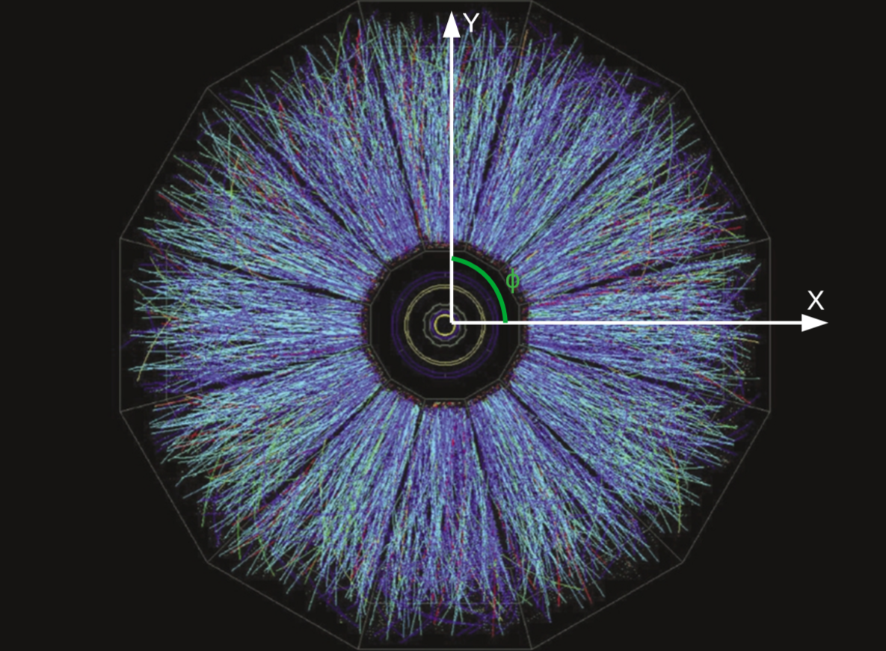

---

NOTE: This is page is under construction and is not yet complete. The objective is to introduce the material for my research, and some of the work I did.The source code that generated the plots is available in the github link at the top, the data is not available however.

The largest project I worked on during graduate school was studying a resonance called f0(980). This resonance is particularly interesting because it is a candidate for potentially several kinds of exotic behavior/composition. The behavior I was most hopeful for was for f0 to possibly contain four quarks.

# Introduction:

Depending on your level of familiarity with high energy nuclear physics (HENP), you could skip this section. Here I will try to lay out some of the basic information to understand my research, and the overall system that is being studied.  

The system that people in HENP spend a large amount of time studying is a phase of matter called Quark Gluon Plasma (QGP). The world you generally experience and see is composed almost entirely of atoms and their interactions with other atoms. 

# Detector Details:

As my work was experimental, it is important to relate the equations and observables being measured to the laboratory values. 

# My Research:

$$\begin{equation} 
v_{2} = <cos(2\phi)> 
\end{equation}$$

References:

