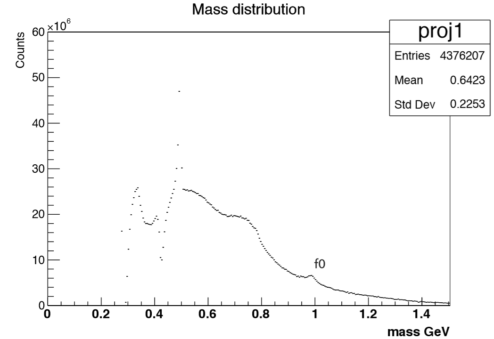
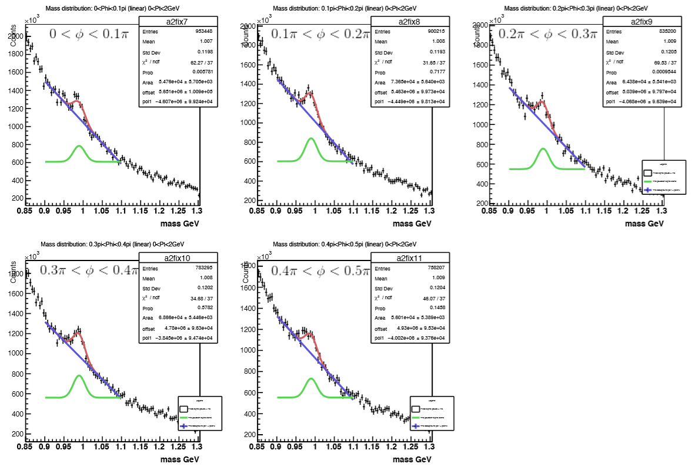
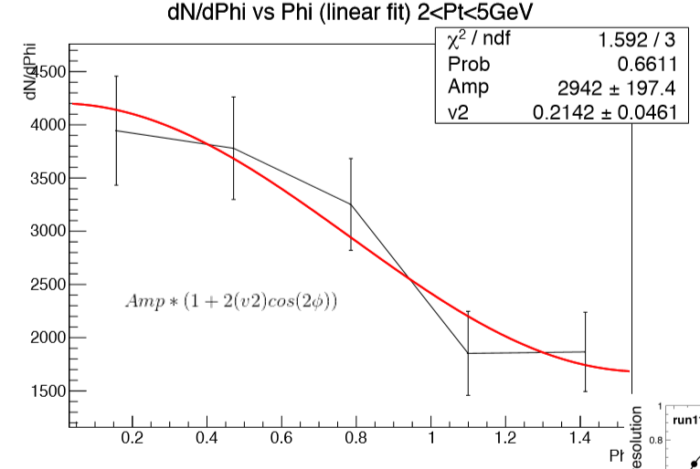
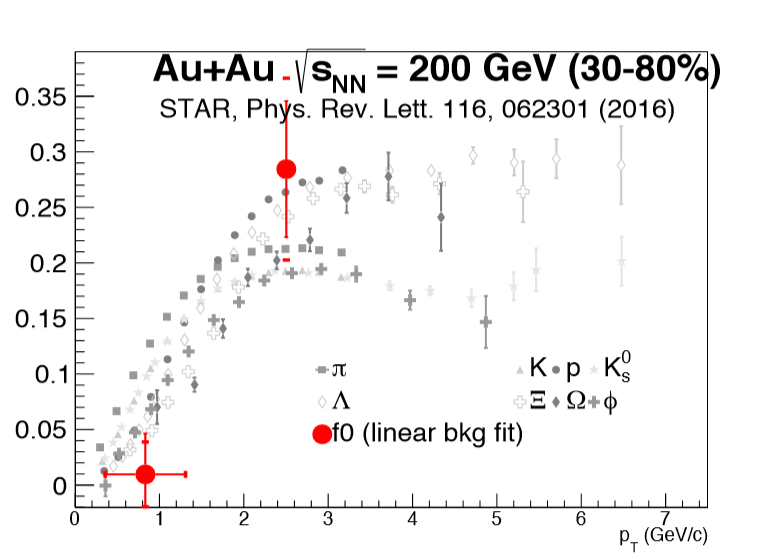
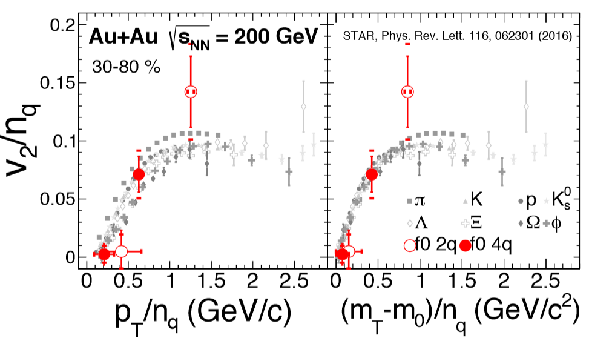

NOTE: This is page is under construction and is not yet complete. The objective is to introduce the material for my research, and some of the work I did.The source code that generated the plots is available in the github link at the top, the data is not available however.

The largest project I worked on during graduate school was studying a resonance called f0(980). The objective of the research was to 

